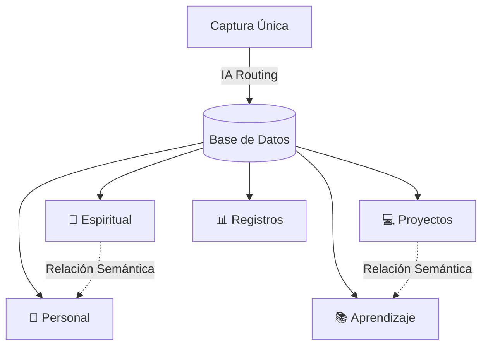

# Documento de Especificaciones Técnicas y de Diseño

## Sistema Operativo Personal: "Zero-Friction" (Monograph)

Este documento detalla la arquitectura de software, flujos de datos y diseño de interfaz para el desarrollo de la aplicación web personal de productividad "Zero-Friction". Está diseñado para servir como guía definitiva de implementación para el equipo de desarrollo.

---

## 1. Visión General y Filosofía de Diseño

El sistema tiene como objetivo principal eliminar el **parálisis por análisis** y la **deuda cognitiva** asociados a la organización manual de tareas y notas.

### Principios Fundamentales:

- **Captura de Fricción Cero**: El usuario solo escribe o habla. No decide carpetas, etiquetas, ni prioridades en el momento de la captura.
- **Inteligencia en Segundo Plano**: Un motor de IA (LLM + Embeddings) clasifica, limpia y enlaza la información de manera asíncrona.
- **Aislamiento de Contexto**: El Dashboard "Today" muestra lo que requiere acción inmediata; los "Hubs" se aíslan completamente para evitar la contaminación mental durante el trabajo profundo (_Deep Work_).
- **Estética Apple Bespoke**: Interfaz ultra-minimalista, con tipografía elegante, espaciado generoso, animaciones fluidas y optimización nativa para modo oscuro.

---

## 2. Arquitectura de Datos: Los 5 Dominios y Relaciones

El sistema almacena toda la información de forma exclusiva dentro de 5 dominios principales. Aunque cada registro pertenece a un dominio físico único, la IA gestiona enlaces de relación transversales en segundo plano.



### Los 5 Dominios:

1. **📖 Espiritual**: Notas de estudio bíblico, resúmenes de lecturas (JW Library, wol.jw.org) y notas de reuniones. Enfoque puro en lectura y crecimiento conceptual.
2. **🧠 Personal**: Reflexiones íntimas, diario, ideas de vida y pensamientos espontáneos. Un caos controlado.
3. **📚 Aprendizaje**: Biblioteca de recursos técnicos reutilizables (apuntes de programación, guías de IA, documentación, tutoriales).
4. **💻 Proyectos**: Tareas accionables, seguimiento de proyectos de desarrollo, hitos y resultados prácticos.
5. **📊 Registros**: Métricas y datos históricos (Fuerza/Gimnasio, Finanzas, Hábitos). Requiere esquemas de datos estructurados para su visualización gráfica.

### Relaciones Dinámicas (Zettelkasten Semántico):

- **Modelo Físico**: Cada nota/tarea tiene una única clave foránea a un dominio (`domain_id`).
- **Relaciones Vectoriales**: Mediante el uso de un modelo de _embeddings_ (ej. `text-embedding-3-small` en pgvector), el sistema calcula la similitud semántica entre notas al guardarse.
- **Enlaces Automáticos**: Si una nota de `Proyectos` (ej. _"Estudiar TypeScript para la app de fincas"_) tiene alta similitud con una nota de `Aprendizaje` (ej. _"Guía rápida de TypeScript"_), el sistema crea una entrada en la tabla `NoteRelationships`.
- **Visualización Aislada**: En el Hub de `Aprendizaje`, estas tareas cruzadas no ensucian el contenido principal de estudio, sino que se muestran en un panel colapsable inferior titulado _"Vínculos Externos"_.

---

## 3. Flujo de Captura y Procesamiento

El flujo de entrada está optimizado para capturar ideas en menos de 2 segundos, procesándolas en segundo plano sin interrumpir al usuario.

```
[Captura de Texto/Voz]
       │
       ├───> Cliente: Crea Borrador Local "Procesando..." (Feedback instantáneo)
       │
       └───> Backend (Asíncrono)
                 │
                 ├───> API Whisper (si es voz) -> Transcripción
                 │
                 ├───> LLM Pipeline
                 │         ├───> Clasificación de Dominio
                 │         ├───> Limpieza de Texto (quita 'hoy', '!', etc.)
                 │         └───> Extracción de Metadatos (due_date, metrics)
                 │
                 └───> DB: Guarda Registro & pgvector calcula relaciones
                           │
                           └───> WebSocket: Notifica al cliente y morph del Borrador
```

### 3.1. Caja de Captura Inteligente (Overlay)

- **Acceso**:
  - _Móvil_: Un botón flotante circular sutil en la parte inferior central abre el overlay.
  - _Escritorio_: Se abre instantáneamente con el atajo `Cmd + K` o `Option + Espacio`.
- **Doble función**: La barra sirve para capturar o para buscar. Al empezar a escribir, muestra resultados de búsqueda semántica en tiempo real debajo. Si pulsas `Enter` directamente, se guarda como nueva nota, evitando así la duplicación de apuntes.
- **Procesamiento NLP en Cliente**: Mientras el usuario escribe, expresiones como "mañana" o "!" se detectan en tiempo real en la interfaz para mostrar chips visuales de confirmación antes de enviar.

### 3.2. Captura por Voz y Temporizador Dinámico (Smart Auto-Send)

1. El usuario pulsa el icono de micrófono y graba su nota.
2. Al detener la grabación, la voz se transcribe en tiempo real en la caja de texto.
3. Se inicia un **temporizador dinámico de envío automático** proporcional a la longitud de la nota:
   - Notas cortas (1-5 palabras): 3 segundos.
   - Notas largas (varias frases): hasta 8 o 10 segundos para dar tiempo a leer la transcripción.
4. Un círculo de progreso visual indica la cuenta atrás.
5. **Efecto Escape Hatch**: Si el usuario toca la pantalla, el teclado o el texto, la cuenta atrás se cancela inmediatamente y el sistema pasa a modo de edición y envío manual.

### 3.3. Sincronización en Tiempo Real (Draft Morphing)

1. Al enviar la nota, el cliente genera un registro provisional con `status: "processing"`.
2. Si la nota parece una tarea de hoy, se renderiza inmediatamente en el Dashboard **Today** con un indicador animado de _"Procesando..."_.
3. El backend realiza las llamadas de IA. Al finalizar, emite un evento vía **WebSockets (o Server-Sent Events)** con los datos limpios y estructurados.
4. El borrador local en la interfaz transiciona suavemente (morphing) al estado final verificado.

---

## 4. Interfaz de Consumo: Modo Ejecución (Today)

El Dashboard "Today" es la pantalla de inicio del sistema y está diseñado para dirigir el enfoque sin generar estrés visual.

```
┌────────────────────────────────────────────────────────┐
│                        TODAY                           │
├────────────────────────────────────────────────────────┤
│  [⭐ FOCUS WIDGET]                                     │
│  Trabajando ahora en: Rediseñar API de Fincas (Proy)   │
├────────────────────────────────────────────────────────┤
│  [📅 TAREAS DE HOY]                                     │
│  ┌─┐ Importante: Presentar presupuesto !               │
│  ┌─┐ Comprar materiales para el jardín                 │
│  (Lista ordenada por prioridad. Sin límites rígidos)   │
├────────────────────────────────────────────────────────┤
│  [🧹 CONSOLA DE MANTENIMIENTO] (Aparece si hay retraso)│
│  Tienes 3 tareas del pasado sin resolver:              │
│  • Enviar correo a Juan -> [Hoy] [Mañana] [Backlog] [X]│
├────────────────────────────────────────────────────────┤
│  [🔄 RESURGIMIENTO]                                    │
│  "Hace 8 meses escribiste en Personal:"                │
│  "Debo aprender a decir no a compromisos vacíos..."     │
│  [Añadir Reflexión] [Rotar Nota]                       │
├────────────────────────────────────────────────────────┤
│  [📊 RUTINA / HÁBITOS]                                  │
│  ( Leer )   ( Beber Agua )   ( Meditar )               │
└────────────────────────────────────────────────────────┘
```

### Componentes del Dashboard Today:

- **Focus Widget (Cabecera)**: Bloque destacado superior que muestra de forma exclusiva la tarea del dominio `Proyectos` que se encuentra en estado `in_progress` (multi-día).
- **Lista de Tareas de Hoy**: Muestra todas las tareas que vencen hoy, sin límites de visualización rígidos, ordenadas con las marcadas como importantes (`is_important: true`) en la parte superior.
- **Consola de Mantenimiento**: Módulo de autolimpieza cognitiva. Si hay tareas atrasadas o importantes sin fecha, aparecen listadas de forma compacta con botones rápidos de un solo toque:
  - `[Hoy]`: Pasa la fecha a hoy.
  - `[Mañana]`: Pospone 24 horas.
  - `[Al Backlog]`: Quita la fecha límite pero mantiene la tarea viva dentro del Hub de Proyectos.
  - `[Dejar aquí]`: Mantiene la tarea atrasada en la lista de hoy de forma temporal sin reprogramar.
- **Fila de Hábitos**: Burbujas minimalistas de hábitos. Un toque las ilumina como completadas.
- **Bloque de Resurgimiento**: Muestra de manera aleatoria una nota del dominio `Espiritual` o `Personal` con una antigüedad superior a 6 meses.
  - Acción: Un botón de `[Añadir Reflexión]` abre un hilo de comentarios enlazados cronológicamente para documentar la evolución de tus pensamientos.
- **Validación de Suscripciones**: Módulo condicional que pregunta al usuario si le han cobrado un gasto fijo recurrente programado para ese día (ej: _"¿Te han cobrado hoy Netflix (15.99€)?"_ con opciones `[Sí]` / `[No]`).

---

## 5. Hubs de Consumo Específicos: Modo Deep Work

Al entrar a un Hub, la barra de navegación y la información de los otros 4 dominios se ocultan por completo.

### 5.1. Hub Espiritual

- **Toma de Notas**: Editor Markdown minimalista optimizado para escribir y leer de forma cómoda.
- **Etiquetas Inteligentes**: El LLM extrae automáticamente conceptos clave (ej: `[Oración]`, `[Paciencia]`, `[Gálatas]`) que se muestran en la cabecera como filtros rápidos.
- **Acción Conectada (Metas)**: El LLM propone 1 o 2 aplicaciones prácticas tras el estudio. El usuario puede hacer clic en `[Aceptar como Meta]` y esta sugerencia se duplica automáticamente como una tarea en el dominio `Proyectos`, introduciéndola directamente en el flujo del Dashboard Today.

### 5.2. Hub de Registros (3 Sub-vistas)

#### A) Fuerza (Gimnasio)

- **Hevy CSV Importer (Parada Temprana)**:
  - Se sube el CSV exportado de Hevy.
  - El backend inspecciona la fecha del último entrenamiento registrado en la base de datos.
  - Lee el CSV de arriba a abajo (más nuevo a más antiguo).
  - En el momento en que encuentra un entrenamiento cuya fecha ya existe en la base de datos, **el parser se detiene al instante**, evitando leer y procesar miles de registros repetidos.
- **Gráficas**: Líneas de evolución del volumen de entrenamiento y estimación de 1-Rep Max (1RM) para los ejercicios principales.
- **AI Coach**: Un LLM analiza periódicamente el progreso (deltas de peso/volumen) y escribe un cuadro de texto con consejos personalizados (ej: _"Llevas 3 semanas estancado en Sentadillas; te aconsejo reducir un 10% el peso de trabajo para acumular volumen"_).

#### B) Finanzas

- **Ciclo de Nómina Dinámico**: El mes financiero no se calcula del 1 al 30 de forma rígida. Cada vez que el usuario registra un ingreso bajo la categoría "Nómina", el sistema detecta que se inicia un nuevo ciclo financiero de forma automática.
- **Visualización**:
  - Balance Neto del ciclo actual (Ingresos del ciclo - Gastos del ciclo).
  - Gráfico circular ultra-limpio con la distribución del gasto en 5 categorías básicas (Gastos Fijos, Alimentación, Ocio, Transporte, Inversión).
- **Gestión de Suscripciones**: Panel para añadir suscripción (`Nombre`, `Importe`, `Día de cobro`).

#### C) Hábitos

- **Visualización**:
  - Contador con racha de días activos actuales (🔥).
  - Mapa de calor mensual (cuadrícula de consistencia estilo GitHub) para ver el cumplimiento de forma agregada.

---

## 6. Esquema de Base de Datos (Prisma & pgvector)

Para estructurar la persistencia de datos bajo un enfoque multi-tenant, utilizaremos el siguiente esquema de Prisma ORM optimizado para PostgreSQL.

```prisma
datasource db {
  provider = "postgresql"
  url      = env("DATABASE_URL")
}

generator client {
  provider = "prisma-client-js"
}

enum Domain {
  ESPIRITUAL
  PERSONAL
  APRENDIZAJE
  PROYECTOS
  REGISTROS
}

enum NoteStatus {
  DRAFT
  NEEDS_REVIEW
  ACTIVE
  IN_PROGRESS
  DONE
}

model User {
  id            String         @id @default(cuid())
  email         String         @unique
  passwordHash  String
  createdAt     DateTime       @default(now())
  updatedAt     DateTime       @updatedAt

  notes         Note[]
  relationships NoteRelationship[]
  workouts      Workout[]
  transactions  Transaction[]
  subscriptions Subscription[]
  habits        Habit[]
}

model Note {
  id            String             @id @default(cuid())
  userId        String
  user          User               @relation(fields: [userId], references: [id], onDelete: Cascade)
  title         String
  content       String
  domain        Domain
  status        NoteStatus         @default(ACTIVE)
  dueDate       DateTime?
  isImportant   Boolean            @default(false)
  tags          String[]

  // pgvector: Almacena la representación matemática de la nota para el Grafo
  embedding     Unsupported("vector(1536)")?

  createdAt     DateTime           @default(now())
  updatedAt     DateTime           @updatedAt

  incomingLinks NoteRelationship[] @relation("TargetNote")
  outgoingLinks NoteRelationship[] @relation("SourceNote")
}

model NoteRelationship {
  id           String   @id @default(cuid())
  userId       String
  user         User     @relation(fields: [userId], references: [id], onDelete: Cascade)

  sourceNoteId String
  sourceNote   Note     @relation("SourceNote", fields: [sourceNoteId], references: [id], onDelete: Cascade)

  targetNoteId String
  targetNote   Note     @relation("TargetNote", fields: [targetNoteId], references: [id], onDelete: Cascade)

  similarity   Float?
  isManual     Boolean  @default(false)

  createdAt    DateTime @default(now())

  @@unique([sourceNoteId, targetNoteId])
}

model Workout {
  id        String       @id @default(cuid())
  userId    String
  user      User         @relation(fields: [userId], references: [id], onDelete: Cascade)
  title     String
  date      DateTime
  duration  String?
  createdAt DateTime     @default(now())
  updatedAt DateTime     @updatedAt

  sets      WorkoutSet[]

  @@unique([userId, date])
}

model WorkoutSet {
  id           String   @id @default(cuid())
  workoutId    String
  workout      Workout  @relation(fields: [workoutId], references: [id], onDelete: Cascade)
  exerciseName String
  weight       Float
  reps         Int
  setType      String
  supersetId   String?
}

model Transaction {
  id             String        @id @default(cuid())
  userId         String
  user           User          @relation(fields: [userId], references: [id], onDelete: Cascade)
  amount         Float
  description    String
  date           DateTime
  category       String

  subscriptionId String?
  subscription   Subscription? @relation(fields: [subscriptionId], references: [id], onDelete: SetNull)

  createdAt      DateTime      @default(now())
  updatedAt      DateTime      @updatedAt
}

model Subscription {
  id           String        @id @default(cuid())
  userId       String
  user         User          @relation(fields: [userId], references: [id], onDelete: Cascade)
  name         String
  amount       Float
  dayOfMonth   Int
  createdAt    DateTime      @default(now())
  updatedAt    DateTime      @updatedAt

  transactions Transaction[]
}

model Habit {
  id        String     @id @default(cuid())
  userId    String
  user      User       @relation(fields: [userId], references: [id], onDelete: Cascade)
  name      String
  frequency String
  createdAt DateTime   @default(now())
  updatedAt DateTime   @updatedAt

  logs      HabitLog[]
}

model HabitLog {
  id        String   @id @default(cuid())
  habitId   String
  habit     Habit    @relation(fields: [habitId], references: [id], onDelete: Cascade)
  date      DateTime
  completed Boolean  @default(true)
  createdAt DateTime @default(now())
  updatedAt DateTime @updatedAt

  @@unique([habitId, date])
}
```

---

## 7. Stack Tecnológico e Infraestructura

- **Frontend**: React (Next.js App Router) + Vanilla CSS (Apple Bespoke Design System). Configurado como Progressive Web App (PWA) para instalación nativa en macOS y iOS.
- **Backend**: Next.js API Routes (Serverless) o Node.js/Express.
- **Base de Datos**: PostgreSQL (Supabase o Neon) con la extensión **pgvector** habilitada para la búsqueda semántica y el cálculo de afinidad del grafo. Prisma como ORM.
- **Capa de IA**:
  - API externa de OpenAI/Anthropic/DeepSeek para clasificación de intenciones, extracción de JSON, limpieza de texto y generación de metas.
  - API de OpenAI Whisper para la transcripción de notas de voz.
- **Seguridad y Acceso**:
  - Aplicación pública en dominio propio protegida por una **Pantalla de Contraseña Maestra**.
  - Al ingresar la contraseña correcta, el backend firma un token seguro HTTP-Only (duración de 1 año) que mantiene la sesión abierta en el navegador del dispositivo, denegando el acceso API a cualquier usuario no autenticado.
